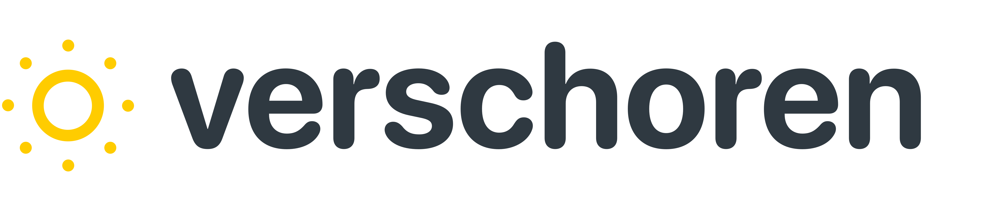
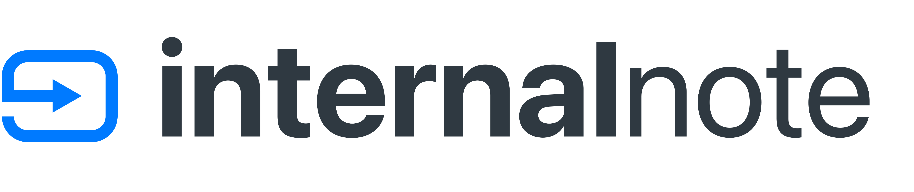

### Hi there, I'm Thomas
Problem solver with a passion for Apple sitting behind a Zendesk.

# Projects
<table style="border: none;">
<tr style="border:none;">
  <td style="width:50%;border:none;" valign="top">
     
    My personal blog
    </td>
    <td style="width:50%;border:none;" valign="top">
     
    A blog about Zendesk with a focus on development and the Sunshine platform
    </td>
  </tr>
</table>

# Recent Blog Posts
* [Improve Your Content Discoverability with a Linked List in Zendesk Guide](https://internalnote.com/linked-list-for-guide/)
* [Expanded API Support via Custom Authentication for Zendesk Webhooks](https://internalnote.com/custom-authentication-for-webhooks-update/)
* [Deep-dive into What's New for Zendesk in March 2023](https://internalnote.com/whats-new-march-2023/)
* [Monthly Note for March 2023](https://internalnote.com/link-list-for-march-2023/)
* [Cleaning up Zendesk Organisations with a sidebar app](https://internalnote.com/cleaning-up-organisations-with-a-sidebar-app/)

# Recent Code Samples
